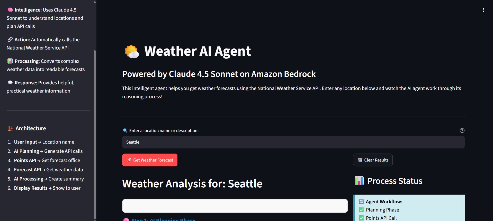
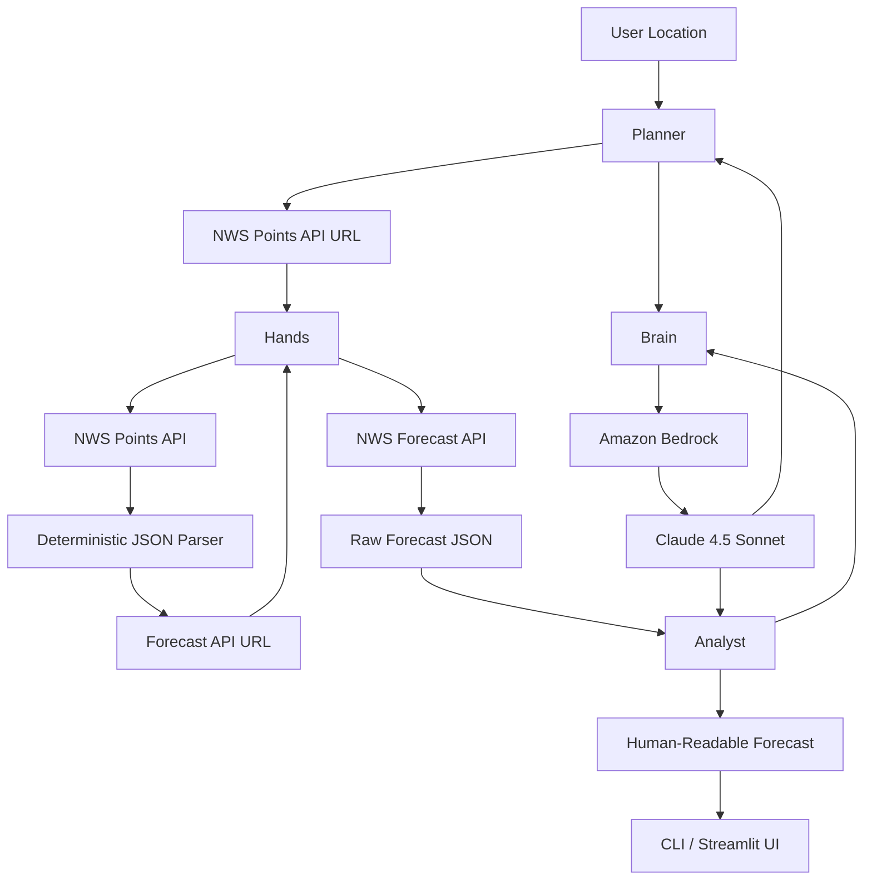
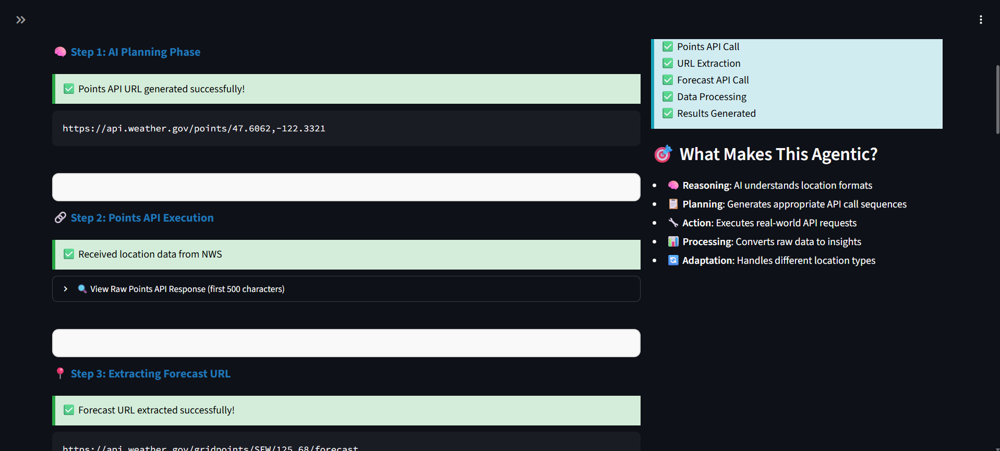
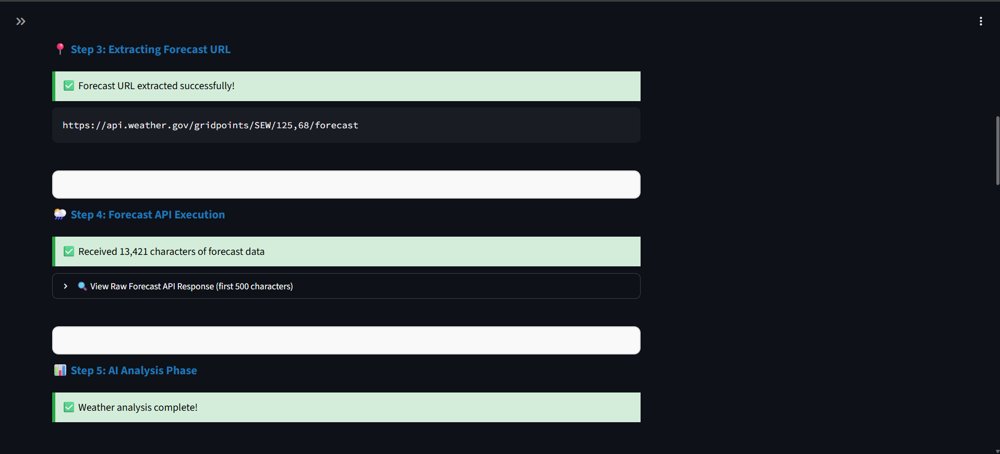
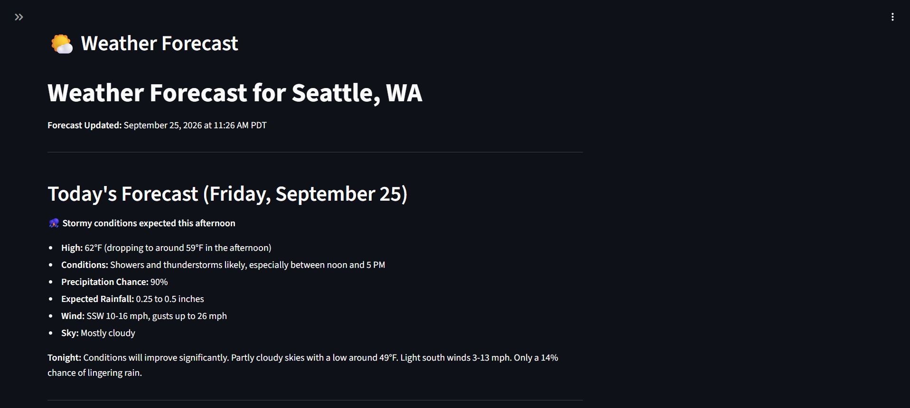
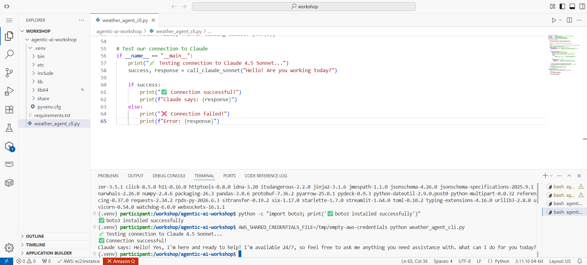
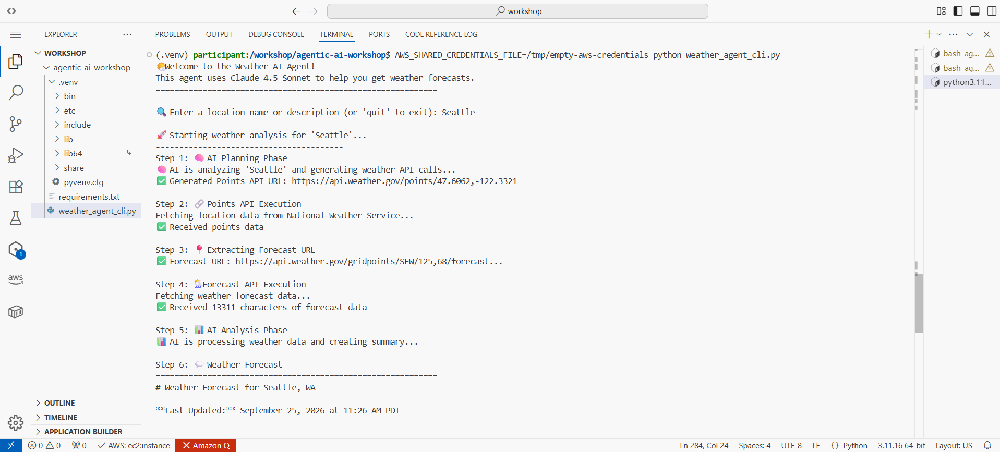
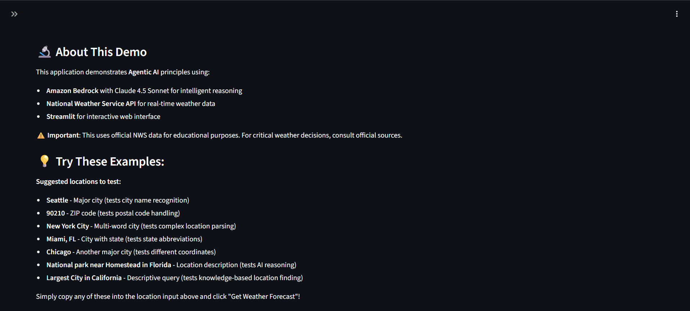

# AWS Agentic AI Weather Agent

A hands-on Agentic AI application built with **Python, Amazon Bedrock, Claude 4.5 Sonnet, the National Weather Service API, and Streamlit**.

The project demonstrates how a natural-language request can be transformed into a multi-step workflow that plans an action, interacts with external APIs, processes structured data, and returns a human-readable result.



---

## Project Overview

This project implements a weather-focused AI agent using a simple agentic architecture built directly with Python and the AWS SDK, without an agent framework.

Given a location such as:

```text
Seattle
90210
New York City
National park near Homestead in Florida
Largest City in California
```

the application can:

1. Interpret the user's location request.
2. Generate an appropriate National Weather Service Points API URL.
3. Execute the API request.
4. Extract the corresponding forecast endpoint.
5. Retrieve detailed forecast data.
6. Use Claude to transform the raw JSON response into a readable weather summary.

The project includes both a **command-line interface (CLI)** and an interactive **Streamlit web application**, while using the same underlying agent logic.

---

## Objective

The primary goal of this project was to understand the fundamental building blocks behind Agentic AI systems by implementing the workflow directly rather than relying on higher-level agent frameworks.

The project explores how an AI application can combine:

- Large language model reasoning and planning
- Deterministic Python logic
- External API execution
- Structured JSON processing
- Natural-language generation
- Error handling
- Interactive user interfaces

A central design principle is to use the language model where interpretation or transformation is useful while keeping deterministic operations in regular Python code.

---

## Agentic AI Pattern

The application follows the general workflow:

```text
Problem → Plan → Action → Result
```

For this weather agent:

```text
User Location
     ↓
AI Planning
     ↓
NWS Points API
     ↓
Forecast URL Extraction
     ↓
NWS Forecast API
     ↓
AI Analysis
     ↓
Readable Forecast
```

The language model is used during the **planning** and **analysis** stages, while API execution and JSON extraction remain deterministic.

---

## Architecture



---

## Four Building Blocks

The agent is organized around four main functions, each with a single responsibility.

| Function | Role | Responsibility |
|---|---|---|
| `call_claude_sonnet()` | **Brain** | Sends prompts to Claude 4.5 Sonnet through Amazon Bedrock |
| `generate_weather_api_calls()` | **Planner** | Converts a natural-language location into an NWS Points API URL |
| `execute_curl_command()` | **Hands** | Executes HTTP requests against external APIs |
| `process_weather_response()` | **Analyst** | Converts raw forecast JSON into a readable summary |

The application also uses:

```python
get_forecast_url_from_points_response()
```

to deterministically extract the forecast endpoint returned by the Points API.

This step does **not** require an LLM call because the value already exists at a known location in the JSON response:

```text
properties.forecast
```

This separation demonstrates an important design principle:

> Use AI when reasoning or language understanding is valuable, and use deterministic code when the answer can be obtained reliably through normal program logic.

---

## Six-Step Agent Workflow

### 1. AI Planning

The user enters a location in natural language.

Examples include:

```text
Seattle
90210
Largest City in California
```

Claude interprets the input and generates a National Weather Service Points API URL:

```text
https://api.weather.gov/points/{latitude},{longitude}
```



---

### 2. Points API Execution

The application sends an HTTP request to the NWS Points API.

The Points API maps latitude and longitude coordinates to the appropriate National Weather Service forecast office and grid.

---

### 3. Forecast URL Extraction

Instead of asking the model to construct another URL, Python parses the Points API JSON response and extracts:

```text
properties.forecast
```

This produces an endpoint similar to:

```text
https://api.weather.gov/gridpoints/SEW/125,68/forecast
```

Using deterministic parsing here reduces unnecessary model calls and keeps the workflow more predictable.

---

### 4. Forecast API Execution

The agent executes the forecast endpoint and receives detailed weather data as JSON.

The returned response can contain thousands of characters describing multiple forecast periods.

---

### 5. AI Analysis

The raw forecast JSON is passed to Claude through Amazon Bedrock.

Claude converts the structured weather data into a concise and readable forecast containing information such as:

- Temperature
- Weather conditions
- Precipitation
- Wind
- Short-term outlook
- Multi-day forecast



---

### 6. Result

The processed forecast is displayed to the user through either the CLI or Streamlit interface.



---

## Amazon Bedrock Integration

The project uses the AWS SDK for Python (`boto3`) to connect to the Amazon Bedrock Runtime.

The application invokes:

```text
Claude 4.5 Sonnet
```

through the Bedrock Converse API.

The workshop configuration used:

```text
AWS Region: us-west-2
```

and a Claude Sonnet model available through Amazon Bedrock.

Before developing the full agent, the connection was validated independently.



This test confirmed the communication path:

```text
Python
   ↓
boto3
   ↓
Amazon Bedrock Runtime
   ↓
Claude
   ↓
Model Response
```

---

## Command-Line Agent

The first implementation uses a Python command-line interface.

The CLI exposes the complete workflow and makes each stage visible while the request is processed:

```text
Step 1: AI Planning Phase
Step 2: Points API Execution
Step 3: Extracting Forecast URL
Step 4: Forecast API Execution
Step 5: AI Analysis Phase
Step 6: Weather Forecast
```



The CLI implementation is useful for observing the sequence directly and for understanding how each function contributes to the complete agent.

---

## Streamlit Web Application

The same core agent logic was then integrated into a Streamlit application.

The web interface provides:

- Natural-language location input
- Visual workflow progress
- Generated API endpoints
- Expandable API response previews
- Processing status
- Human-readable weather results
- Example queries for testing different input formats

The agent logic remains the same between the CLI and web versions; only the presentation layer changes.


---

## Why This Is Agentic

Within the scope of this workflow, the application demonstrates several characteristics associated with Agentic AI.

### Reasoning

The model interprets different forms of location input rather than requiring one rigid format.

For example:

```text
Seattle
```

and:

```text
Largest City in California
```

require different forms of interpretation before an API request can be generated.

### Planning

The model translates a natural-language goal into a concrete action:

```text
Location description
        ↓
Coordinates
        ↓
NWS Points API URL
```

### Action

The Python application interacts with an external real-world service by executing HTTP requests against the National Weather Service API.

### Processing

The workflow combines model-driven and deterministic processing.

Python extracts known structured values directly from JSON, while Claude handles tasks where language interpretation or summarization is useful.

### Adaptation

The same workflow can process different input formats without requiring a hardcoded branch for every supported city or ZIP code.

---

## Technologies & Tools

| Technology | Purpose |
|---|---|
| **Python** | Core agent implementation |
| **Amazon Bedrock** | Managed access to foundation models |
| **Claude 4.5 Sonnet** | Planning and forecast summarization |
| **boto3** | AWS SDK for Python |
| **National Weather Service API** | Weather and forecast data |
| **Streamlit** | Interactive web interface |
| **JSON** | Structured API response processing |
| **curl / subprocess** | External HTTP API execution |
| **VS Code** | Development environment |

---

## Project Structure

```text
aws-agentic-ai-weather-agent/
│
├── README.md
├── .gitignore
├── requirements.txt
│
├── src/
│   ├── weather_agent_cli.py
│   └── weather_agent_web.py
│
└── screenshots/
    ├── bedrock-connection.png
    ├── cli-agent-workflow.png
    ├── streamlit-web-interface.png
    ├── agent-workflow-planning.png
    ├── agent-workflow-analysis.png
    ├── weather-forecast-result.png
    └── application-overview.png
```

---

## Setup

### Prerequisites

To run the project outside the facilitated workshop environment, you will need:

- Python 3
- `pip`
- `curl`
- An AWS account
- Valid AWS credentials
- Permission to use Amazon Bedrock
- Access to the Claude model referenced by the application
- Internet access to `api.weather.gov`

Model availability and permissions may vary by AWS account and region.

---

### 1. Clone the Repository

```bash
git clone <repository-url>
cd aws-agentic-ai-weather-agent
```

---

### 2. Create a Virtual Environment

```bash
python -m venv .venv
```

On macOS/Linux:

```bash
source .venv/bin/activate
```

On Windows:

```powershell
.venv\Scripts\activate
```

---

### 3. Install Dependencies

```bash
pip install -r requirements.txt
```

---

### 4. Configure AWS Authentication

The application relies on the normal AWS credential provider chain used by `boto3`.

Before running the project, verify that your environment can authenticate to AWS:

```bash
aws sts get-caller-identity
```

Do **not** place AWS access keys, secret keys, or session tokens directly in the source code or commit them to GitHub.

IAM roles, AWS IAM Identity Center/SSO, or another appropriate AWS credential provider should be preferred when available.

---

## Running the CLI Agent

From the repository root:

```bash
python src/weather_agent_cli.py
```

The application will prompt:

```text
Enter a location name or description:
```

Example:

```text
Seattle
```

The agent will then execute its six-step workflow and display the generated forecast directly in the terminal.

---

## Running the Web Application

Start Streamlit with:

```bash
streamlit run src/weather_agent_web.py
```

Streamlit will provide a local browser address, typically:

```text
http://localhost:8501
```

Open the application and enter a location to start the workflow.

---

## Example Inputs

The application was designed to demonstrate different forms of user input:

```text
Seattle
90210
New York City
Miami, FL
Chicago
National park near Homestead in Florida
Largest City in California
```

These examples exercise city recognition, ZIP-code handling, multi-word locations, state abbreviations, and more descriptive natural-language requests.



---

## Error Handling

Each major operation returns a tuple in the form:

```python
(success, value)
```

or:

```python
(success, error_message)
```

Before proceeding to the next stage, the application checks whether the previous operation succeeded.

This structure allows failures to surface as understandable messages instead of causing the entire workflow to terminate with an unhandled exception.

Handled situations include:

- Amazon Bedrock invocation errors
- API request failures
- HTTP request timeouts
- Invalid model output
- JSON parsing failures
- Missing forecast fields
- Empty user input

---

## Key Concepts Learned

This project strengthened my understanding of:

- Agentic AI architecture
- Problem → Plan → Action → Result workflows
- Foundation model integration with Amazon Bedrock
- AWS SDK usage with `boto3`
- Prompt engineering for machine-consumable output
- Prompt engineering for human-readable output
- API orchestration
- Chaining dependent API requests
- JSON parsing
- Separation of probabilistic and deterministic operations
- Error-resilient application design
- CLI application development
- Streamlit application development
- Secure handling of AWS credentials

One of the most important lessons from the project was that an agent does not require every step to be handled by an LLM.

A more reliable architecture can combine:

```text
AI reasoning
     +
Deterministic code
     +
External tools/APIs
```

with each component used where it provides the most value.

---

## Skills Demonstrated

Through this project, I practiced:

- Connecting Python applications to Amazon Bedrock
- Invoking Claude through the Bedrock Converse API
- Designing modular agent components
- Translating natural-language input into executable actions
- Working with REST API responses
- Parsing and validating JSON
- Implementing multi-step application workflows
- Building error-handling paths
- Developing CLI and web interfaces
- Using Streamlit for interactive AI applications
- Debugging AWS authentication and Python environments
- Documenting technical workflows for reproducibility

---

## Workshop Context

This project was implemented during the **AWS: Agentic AI Building Blocks** workshop at **ShellHacks at Florida International University (FIU)**.

The workshop focused on building an Agentic AI application directly with Python and the AWS SDK in order to develop a clear understanding of the underlying architecture without relying on agent frameworks or abstractions.

The guided workshop architecture and starter implementation provided the foundation for this project. This repository documents my implementation, testing, execution, observations, and understanding of the concepts introduced during the workshop.

---

## Contributors

This project was completed collaboratively during the AWS: Agentic AI Building Blocks workshop at ShellHacks at Florida International University.

- [Adrian Perez Galindo](https://github.com/AdrianRPG)
- [Diego Rios](https://github.com/alessandrorioslazo-collab)
- [Boris Mino](https://github.com/StBoris04)
- [Piero Espinoza](https://github.com/PieroEB)

---

## Source & Attribution

The original **AWS Agentic AI Building Blocks** workshop materials, architecture, and guided implementation were provided by AWS.

Workshop contributor:

**Ramakrishna Natarajan**  
Sr. Partner Solutions Architect, AWS

This repository is a personal educational and portfolio implementation created while completing the workshop.

Amazon Bedrock, AWS, and related service names are trademarks of Amazon Web Services, Inc.

Claude is developed by Anthropic.

Weather data is retrieved from the U.S. National Weather Service API.

---

## Disclaimer

This repository is intended for educational and portfolio purposes.

It is **not an official AWS repository**, production weather service, or replacement for official weather and emergency information.

For weather-related safety decisions, consult official National Weather Service or other authoritative sources.

No AWS credentials or secrets should be stored in this repository.

No license is currently provided for this repository. Workshop-derived materials remain subject to the terms of their original source.

---

## Potential Improvements

Possible future extensions include:

- Replace coordinate estimation with a dedicated geocoding API
- Add conversational memory
- Add additional external tools and data sources
- Implement weather alerts
- Add request caching
- Add API rate limiting
- Improve structured model output validation
- Replace subprocess-based `curl` calls with a dedicated HTTP client
- Deploy the application using AWS Lambda, ECS, or another managed service
- Add authentication for the web interface
- Add multiple specialized agents
- Connect the weather agent to a travel-planning agent
- Add automated tests for each building block

---

## Conclusion

This project provided a practical introduction to Agentic AI by reducing the architecture to a small set of understandable components.

Rather than treating an AI agent as a black box, the implementation demonstrates how an agent can be assembled from:

```text
Brain + Planner + Hands + Analyst
```

and connected through a structured workflow:

```text
Problem → Plan → Action → Result
```

The project also demonstrated that effective AI applications can combine foundation models with ordinary deterministic software engineering: the model handles tasks requiring language interpretation and summarization, while Python handles API execution, validation, structured-data extraction, control flow, and error handling.

Building both CLI and Streamlit versions helped reinforce that the underlying agent architecture remains independent from the user interface used to interact with it.
